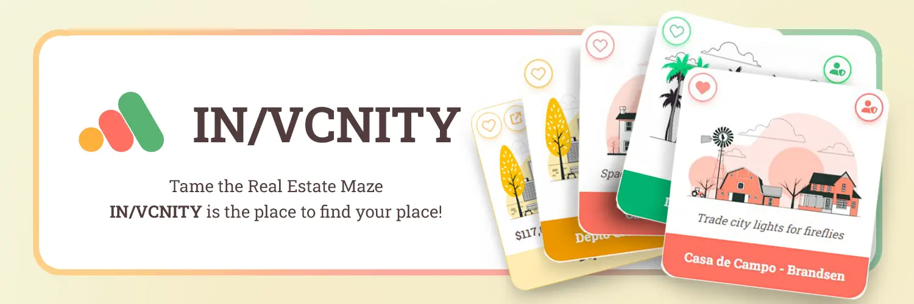
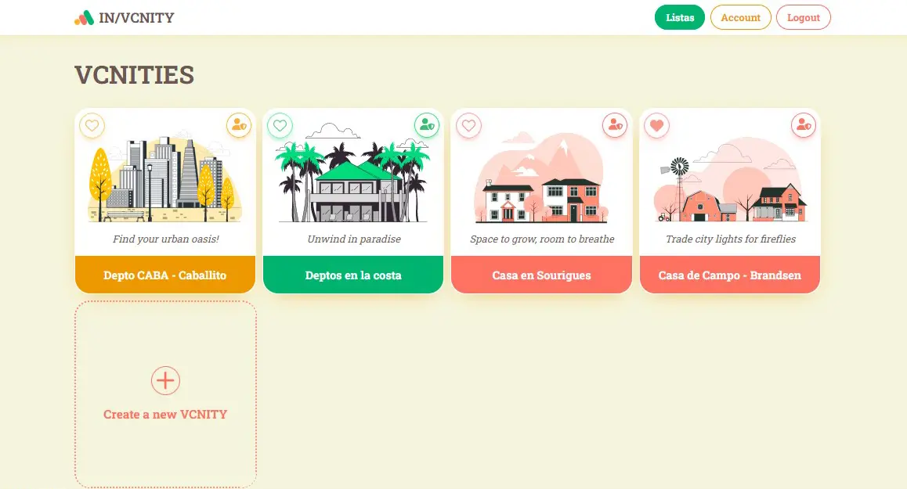
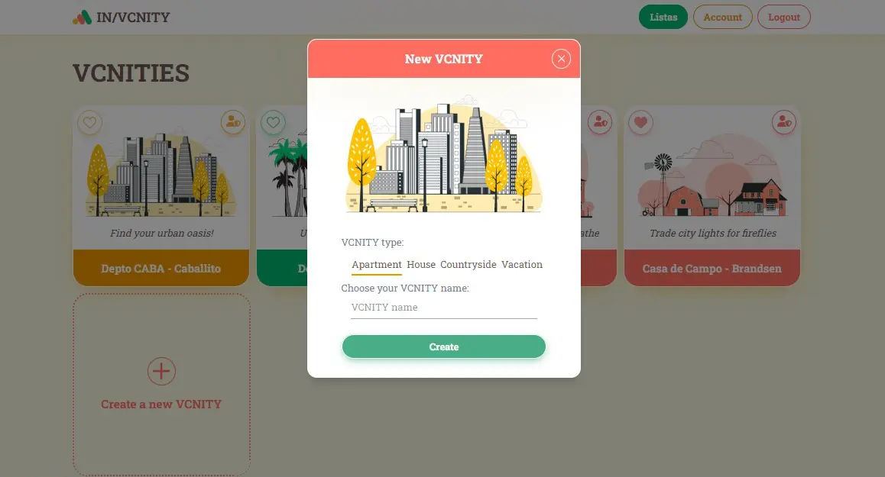
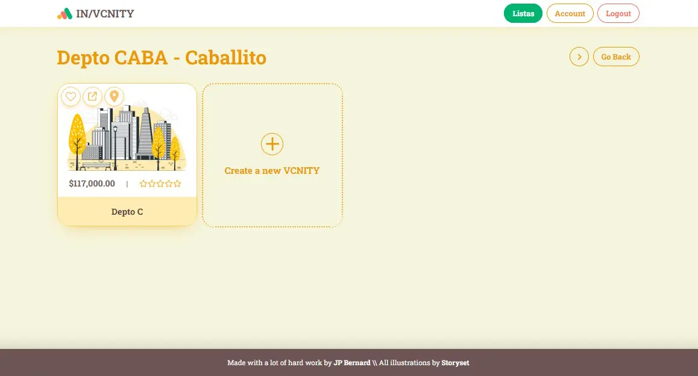
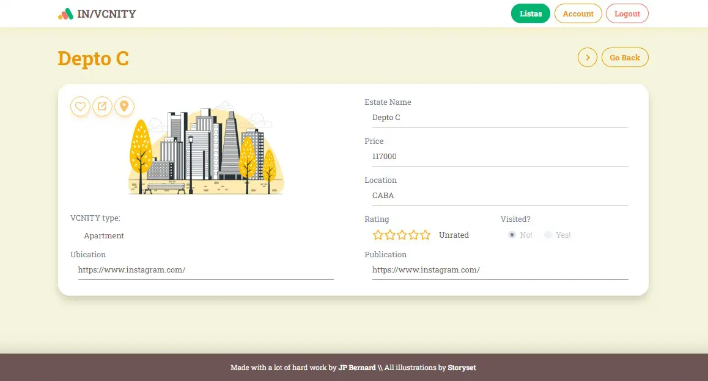

 

This project was conceive as an extension of the NextJS course provided by <a href="https://www.youtube.com/watch?v=rCm5RVYKWVg" target="_blank">FreeCodeCamp</a> and created by <a href="https://www.youtube.com/channel/UCxwvyK3-Xs4zvoGWFT_iDmw" target="_blank">Shadee Merhi</a>. The web design and page layout were created from scratch by me and uses original illustrations from <a href="https://storyset.com/" target="_blank">Storyset</a>.

The purpose of this project was to get a hands-on experience working with NextJS, Firebase, and ChakraUI, and encompass subjects like site structure and routing (using the brand new NextJS' App directory), custom theming with ChakraUI (Client Components) and styling with CSS Modules (RSC), Firebase integration with Firebase Authentication and Firestore to handle data persistance and security, and much more.

 

<h1>Key Features.</h1>

This site work as a "storage" that helps keeping track of all the user's Real Estates findings centralizing all the information on a single plataform. In current times we are expected to navigate multiple plataforms to find a place to live or rent (Airbnb, MercadoLibre, ZonaProps, even Real Estate companies' sites) making it harder to keep track of every single contender we find. This site helps to fill that organizational void and helps to keep the search tight and tidy.

<ul>
  <li>Start off by creating a VCNITY: a themed storage unit that can store multiple Real Estate info units.</li>
  <li>Found a interesting house or apartment? Create a Estate inside the VCNITY with all the information about your findings.</li>
  <li>Did you finally visited the Estate? Did you like it enough to consider it a REAL contender? Do you want to rate it? Then do it! Keep all the information updated.</li>
  <li>One of your findings turn out to be no longer an option? Then delete it and make room to new ones!</li>
</ul>

 
<h2>Create a VCNITY</h2>

Ever come across that perfect property, only to forget the details later? With IN/VCNITY, you can save your searches, favorite listings, and property notes all in one secure place. Create a VCNITY themed around your interest: a vacation site, a new downtown apartment closer to work, an spacious family condo far from the polluted city's night sky!

 
<h2>Create a Estate unit and store its data</h2>

Stay organized and informed throughout your real estate journey. Create a new Estate unit and fill it with all the relevant information: publication link, price, location, you can even asign it a name to make it easier to find it later on. No more digging through emails or scattered notes. Access everything you need, whenever you need it, for a seamless and stress-free experience.

 
<h2>Keep it up to date!</h2>

Don't let outdated information hold you back. After touring a property, quickly mark it as "visited" on our platform. This helps you keep track of your progress and avoid revisiting the same places. Update notes, add impressions, and rate your experience to personalize your search journey and make informed decisions.

